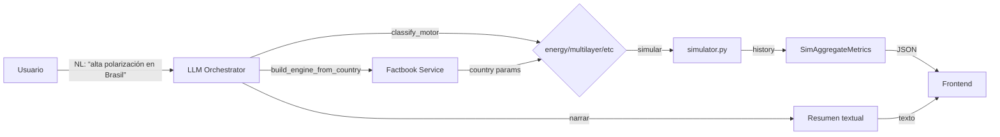

# MASSIVE System Map — Knowledge Contract for LLM Agents

> **Cartógrafo del Sistema** — Fase 0 del Master Orchestrator
> Este documento captura la semántica y arquitectura de MASSIVE para que cualquier LLM pueda operar coherentemente sobre el repositorio.

---

## 1. Arquitectura de Capas

```
┌─────────────────────────────────────────────────────────────────────┐
│  CAPA 1: INTERFAZ PÚBLICA (UI + API)                                │
│  ┌───────────────────────────────────────────────────────────────┐  │
│  │ frontend/ (React + Vite)  ←→  backend/app/ (FastAPI UI-NG)    │  │
│  │   App.tsx, api.ts  ──────►  routers/ (conversación, simulación) │  │
│  │                              status.py, live.py, simulation.py │  │
│  └───────────────────────────────────────────────────────────────┘  │
│                                                                     │
│  CAPA 2: SERVICIOS (service/ — adaptadores entre UI y motores)    │
│  ┌───────────────────────────────────────────────────────────────┐  │
│  │ simulation_service, factbook_service, forecast_service,        │  │
│  │ llm_service, llm_orchestrator (NL→config→motor→narrativa)     │  │
│  └───────────────────────────────────────────────────────────────┘  │
│                                                                     │
│  CAPA 3: DOMINIO (simuladores + núcleo científico)                │
│  ┌───────────────────────────────────────────────────────────────┐  │
│  │ legacy (simulator.py, energy_engine, multilayer, massive)     │  │
│  │                     ──────── reexportado por ────────         │  │
│  │ massive_core/ (adapter científico opt-in)                      │  │
│  │   numerics, data_assimilation, diagnostics, physics, ...       │  │
│  └───────────────────────────────────────────────────────────────┘  │
│                                                                     │
│  CAPA 4: META-LEARNING / CFC                                       │
│  ┌───────────────────────────────────────────────────────────────┐  │
│  │ cfc_engine.py, cfc_router.py, cfc_trainer.py                  │  │
│  │ massive_core/metalearning/                                     │  │
│  └───────────────────────────────────────────────────────────────┘  │
│                                                                     │
│  CAPA 5: DATOS EXTERNOS                                            │
│  ┌───────────────────────────────────────────────────────────────┐  │
│  │ data/factbook/ ──────────────────────► 5 puntos de integración │  │
│  │ massive/core/factbook/ (loader, mappings, validator)          │  │
│  │ datasets/pvu_cases/, datasets/real_cases/                     │  │
│  └───────────────────────────────────────────────────────────────┘  │
│                                                                     │
│  CAPA 6: INFRAESTRUCTURA                                            │
│  ┌───────────────────────────────────────────────────────────────┐  │
│  │ Dockerfile, docker-compose.yml (single-service :8000)        │  │
│  │ .env.example, pyproject.toml, install.sh                      │  │
│  └───────────────────────────────────────────────────────────────┘  │
└─────────────────────────────────────────────────────────────────────┘
```

### Relación backend ↔ engines

```
backend/app/routers/simulation.py
  └── services/simulation_service.py
      ├── run_scalar_simulation()   → simulator.simular()
      ├── run_energy_simulation()   → energy_runner.run_energy_simulation()
      ├── run_multilayer_simulation() → multilayer_engine.MultilayerEngine
      └── run_massive_sim()         → massive_engine.MassiveSimEngine

backend/app/routers/conversation.py
  └── services/llm_orchestrator.py
      ├── classify_motor(): NL → motor (reglas del contrato)
      ├── run_llm_simulation(): pipeline completo
      └── services/factbook_service.py: build_engine_from_country()
```

---

## 2. Flujos de Trabajo Principales

### Flow A: Simulación Legacy (rápida, para UI-NG básica)



**Entry points:** `simulator.simular()`, `run_with_schedule()`
**DTOs:** `SimState`, `SimConfig`, `SimResult` (via `massive_core/contracts.py`)

### Flow B: Simulación Científica con Reportes

```
User → POST /v1/scientific 
  → run_scientific_simulation(state, config, scientific_config)
  → massive_core/scientific_runner.py
    ├─ numerics/steppers.py (Euler-Maruyama adaptativo)
    ├─ data_assimilation/kalman.py (EnKF opcional)
    └─ diagnostics/report.py → ScientificReport
→ JSON {history, scientific_report, assimilation}
```

### Flow C: Integración Factbook (5 puntos)

1. **Datos de muestra**: `data/factbook/factbook_sample.json` (US, CH, GM)
2. **Cargador**: `massive/core/factbook/loader.py` (multi-formato, `FactbookLoader`)
3. **Mappings**: `massive/core/factbook/mappings.py` (`ISO2→CIA`, índices Herfindahl, diversidad)
4. **Validador**: `massive/core/factbook/validator.py` (`FactbookValidator`, `ValidationReport`)
5. **Servicio**: `services/factbook_service.py` → `build_engine_from_country(country_code)` → devuelve `EstadoSimulacion` con parámetros realistas

### Flow D: Benchmarks Canónicos (PVU-BS)

```
benchmarks/runner.py
  → evaluate_case() [offline | llm | real]
    ├── baselines.py (10 baselines: ridge, ridge_lags, ar1, ar1_lags, etc.)
    ├── fidelity.py (MAE, RMSE, polarización)
    ├── walk_forward.py (validación temporal)
    └── turning_points.py (detección de puntos críticos)
  → outputs: metrics.json, report.md
```

---

## 3. APIs / Endpoints

### 3a. UI-NG Backend (`backend/app/main.py`) — Production

| Router | Endpoint | Método | Descripción |
|--------|----------|--------|-------------|
| status | `/health` | GET | Liveness + lightweight readiness |
| status | `/metrics` | GET | Prometheus text-format counters |
| status | `/api/status` | GET | StatusResponse (CfC, LLM) |
| conversation | `/api/conversation` | POST | ConversationRequest → ConversationResponse |
| simulation | `/api/simulate` | POST | SimulateRequest → SimulateResponse (4 engines) |
| simulation | `/api/explain` | POST | ExplainRequest → ExplainResponse (narrativa) |
| live | `/ws/live` | WS | WebSocket tiempo real |
| runs | `/api/runs/{id}` | GET | Snapshot + timeline de run guardado |

### 3b. Endpoints Versionados v1 (Fase 1)

| Endpoint | Método | Descripción |
|----------|--------|-------------|
| `/v1/simulate` | POST | Simulación básica (migración de `/api/simulate`) |
| `/v1/scientific` | POST | Simulación científica con reportes |
| `/v1/factbook` | GET | Parámetros de país / validación |
| `/v1/benchmarks` | POST | Ejecución de benchmarks canónicos |
| `/v1/forecast` | POST | Previsión temporal (ya existente) |
| `/v1/llm/run_simulation` | POST | NL → simulación completa (Fase 6) |

### 3c. Legacy Root API (`api.py`)

| Endpoint | Propósito |
|----------|-----------|
| `/api/extract` | Extracción datos (PDF/etc) |
| `/api/wizard` | Asistente conversacional → WizardResult |
| `/api/simulate-uil` | Endpoint legacy UIL |
| `/` | Info servicio |
| `/health` | Probe |

> **Nota Arquitecto:** `api.py` es legacy y DEBE migrarse a `/v1/*` en `backend/app/main.py`. No usar para nuevos desarrollos.

---

## 4. DTOs Pydantic (`backend/app/models/`)

| Archivo | Clases | Propósito |
|---------|--------|-----------|
| `dto_ui.py` | 10 | ChatMessage, ConversationRequest/Response, SimulateRequest/Response, StatusResponse |
| `dto_simulation.py` | 7 | SimMode, SimEventKind, SimAgentLite, SimAggregateMetrics, SimEventMessage |
| `dto_architect.py` | 3 | InterventionRecord, InterventionLogEntry, ArchitectEventMessage |
| `dto_forecast.py` | 4 | ForecastPoint, Feasibility, ForecastResponse |
| `dto_snapshot.py` | 3 | SnapshotRecord, TimelineTick, TimelineResponse |
| `dto_llm.py` | 3 | LLMRunRequest, LLMRunResponse, LLMAmbiguityResponse |

**TypeScript generation:** `scripts/gen_ts_types.py` → `frontend/src/types/api.generated.ts`

---

## 5. Motores de Simulación

| Motor | Módulo | API Principal | Uso |
|-------|--------|---------------|-----|
| **Scalar (legacy)** | `simulator.py` | `simular()`, `simular_multiples()` | Simulación básica multi-regla |
| **Energy** | `energy_engine.py` | `SocialEnergyEngine`, `run_energy_simulation()` | Langevin, paisaje de energía |
| **Multilayer** | `multilayer_engine.py` | `MultilayerEngine` | 5D Langevin, grafos multiciudad |
| **Massive** | `massive_engine.py` | `MassiveSimEngine` | Escala macro (millones de agentes) |
| **Forecast** | `forecast/` | `forecast()`, `apply_intervention()` | Predicción temporal, contrafácticos |
| **Micro-MASSIVE** | `micro_massive/` | `MicroOrchestrator` | Grupos pequeños (n<200) multi-agente |
| **CfC** | `cfc_*.py` | `CfCRouter`, `CfCTauMatrix` | Meta-learning, selección de régimen |

---

## 6. Matriz de Responsabilidades

| Componente | FastAPI Backend | UI-NG Frontend | Motores |
|-----------|----------------|----------------|---------|
| **Auth** | API-key validation, rate-limit | Store API key, manejar 401 | N/A |
| **Simulación** | Validar request, dispatch | Mostrar resultados, timeline | Ejecutar simulación |
| **Persistencia** | SQLite RunStore | Leer runs guardados | N/A |
| **Realtime** | WebSocket `/ws/live` | Gráfica en vivo | Producir snapshots |
| **LLM Conversación** | Validar, orchestrar | Chat UI, typing indicators | N/A (LLM externo) |
| **Factbook** | Validar país | Mostrar datos contexto | build_engine_from_country |
| **Benchmarks** | Ejecutar via API | Mostrar resultados | Comparar baselines |

---

## 7. Configuración (29 variables — véase `docs/OBSERVABILITY_AND_SECURITY.md`)

Principales:
- `MASSIVE_ENV` (dev/staging/prod)
- `MASSIVE_API_KEYS` (lista de claves)
- `MASSIVE_CORS_ORIGINS` (lista de orígenes permitidos)
- `MASSIVE_SERVE_FRONTEND=1` (servir React build)
- `MASSIVE_DATA_DIR` (directorio de datos/persistence)
- `MASSIVE_RATE_LIMIT_*` (4 variables: enabled, per_minute, simulate_per_minute, window_seconds)
- `MASSIVE_LOG_LEVEL`, `MASSIVE_LOG_FORMAT`
- Variables LLM: `PROVIDER`, `MASSIVE_LLM_MODEL`, `MASSIVE_LLM_TIMEOUT`, `MASSIVE_LLM_MAX_TOKENS`

---

## 8. Stack Docker

```yaml
# docker-compose.yml (single service)
services:
  massive:
    build: .
    ports: ["8000:8000"]
    healthcheck: http://localhost:8000/health
    restart: unless-stopped
    env_file: .env.production
```

Dockerfile multi-stage:
1. Builder: Node 20 (frontend build)
2. Runtime: Python 3.11-slim + uvicorn + frontend estático

---

## 9. Estado de Tests (453 tests)

| Módulo | Tests | Cobertura |
|--------|-------|-----------|
| `massive_engine` | 52 | ~70% |
| `energy_core` | 42 | ~65% |
| `contracts` | 33 | 74% |
| `dto_models` | 28 | 100% |
| `multilayer` | 27 | ~55% |
| `cfc` | 38 | 0% (skipped sin torch) |
| `factbook` | 46 | 50-71% |
| UI-NG tests | 24 | 0% (nueva) |

---

*Documento generado por el Cartógrafo del Sistema — Fase 0.*