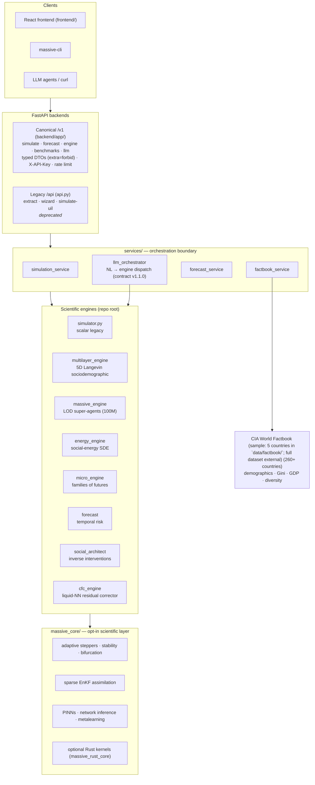

<div align="center">

# MASSIVE

**Mathematical Architecture for Scalable Social Interaction & Virtual Engine**

*A hybrid physics + AI platform that simulates opinion formation, polarization and
intervention outcomes over complex social systems — from 10 agents to 100 million.*

[](LICENSE)
[](pyproject.toml)
[](.github/workflows/pytest.yml)
[](.github/workflows/typecheck.yml)
[](rust_core/)

[Quick start](#-quick-start) · [Architecture](#-architecture) · [API](#-http-api) · [The LLM layer](#-the-llm-layer-natural-language--mathematics) · [Benchmarks](#-benchmarks) · [Docs](#-documentation)

</div>

---

## Why MASSIVE is different

Most social simulators force a choice between scale, scientific rigor and usability.
MASSIVE is **hybrid by design** at every layer:

| Frontier | What we do | Where |
|---|---|---|
| 🌍 **Population-scale via LOD compression** | Agents with identical features collapse into *super-agents*, so **100 million agents run in ~8 GB RAM** — near-constant memory with event-driven, uint8-quantized sparse updates. | `massive_engine.py` |
| 🤖 **LLM as a *mathematical translator*, not a chatbot** | Natural language → validated simulation config under a **versioned machine contract** (v1.1.0): intent classification routes to the right engine, ambiguous requests get `422 + requested_fields`, and every run degrades **deterministically** — basic simulations run without LLM; advanced inverse design fails closed with 503 when no LLM key configured. | `services/llm_orchestrator.py`, `configs/llm_contract/` |
| 🧠 **Liquid neural residual correction** | A Closed-form Continuous-time (CfC) network learns the *systematic bias* of the physics engine and corrects it — **~50% error reduction** on the Brexit 2016 referendum case (validated on 10/10 seeds, see `calibration_log.md` for full metrics). | `cfc_engine.py`, `models/cfc_calibrated/`, `calibration_log.md` |
| 📡 **Data assimilation for opinion dynamics** | Sparse Ensemble Kalman Filter fuses real-world observations into the running state, the way numerical weather prediction does. | `massive_core/data_assimilation/` |
| ⚗️ **Scientific opt-in layer** | Adaptive steppers, stability & bifurcation analysis, physics-informed neural nets, network inference and statistical mechanics — all behind explicit config flags that never alter the default dynamics. | `massive_core/` |
| 🧬 **Inverse intervention design** | Ask *"what campaign reaches this consensus?"* — the social architect searches the intervention space backwards from the goal. | `social_architect.py` |
| ⚡ **Optional Rust kernels** | 3 kernels (multi_potential_gradient, langevin_opinion_update, active_mask_step) compiled with pyo3/maturin — a conceptual PoC, not yet a significant speedup. Transparent pure-Python fallbacks everywhere. | `rust_core/` → `massive_rust_core` |
| 🔬 **Validation-first culture** | Pre-registered anti-leakage protocol, seeded RNG everywhere, contract-validated APIs, 16-check CI, offline PVU benchmark suite. | `datasets/pvu_cases/` (sample cases + `datasets/real_cases/` for validation), `benchmarks/` |

---

## 🚀 Quick start

Verified from a clean clone (Python 3.11+, ~2 min install):

```bash
git clone https://github.com/Adlgr87/MASSIVE.git && cd MASSIVE
python3 -m venv .venv && source .venv/bin/activate
pip install -r requirements.txt
cp .env.example .env          # add LLM/social API keys if you have them (optional)

# Canonical versioned API (/v1/*) — interactive docs at /docs
uvicorn backend.app.main:app --host 0.0.0.0 --port 8000
```

```bash
# First simulation in one command (dev mode accepts the documented fallback key)
curl -H "X-API-Key: dev-secret-key" -X POST localhost:8000/v1/simulate \
     -H 'Content-Type: application/json' -d '{"pasos": 30}'
```

Or use the CLI, no server needed:

```bash
python -m massive.cli simulate --pasos 30            # scalar engine + JSON summary
python -m massive.cli scientific --pasos 100 --report --enkf   # scientific run + diagnostics
python -m massive.cli forecast --state '{"opinion":0.5}' --mode monte_carlo --n-runs 200
python -m massive.cli benchmark --offline --seed 42  # PVU-BS validation
python -m massive.cli version
python -m massive.cli serve                            # uvicorn on :8000
```

Or pure Python, zero server:

```python
from services.simulation_service import run_multilayer_simulation
result = run_multilayer_simulation(n_agents=100, steps=50, seed=42)
print(result["landscape"])
```

**Prefer Docker?**

```bash
cp .env.example .env
docker compose up -d --build   # nginx :80 (SPA + API gateway) · :8000 (direct API)
curl -fsS localhost:8000/health
curl -fsS localhost:80/docs
```

The multi-stage `Dockerfile` (Python builder → Vite frontend build → slim
runtime) runs **supervisord** as a **non-root user**: `uvicorn` (FastAPI,
`:8000`) + **nginx** (`:80`, serving the React SPA + proxying `/api/`,
`/v1/`, `/docs`, `/health`, `/ready`, `/version`, `/metrics`). `setcap` grants
nginx the `CAP_NET_BIND_SERVICE` capability so it can bind `:80` inside the
non-root container; security headers (CSP, HSTS, X-Frame-Options `DENY`,
`nosniff`) are injected at the edge.

> Minimum: Python 3.11, 500 MB RAM. Rust/CUDA/torch/LLM keys are all optional —
> every optional layer has a deterministic fallback.

---

## 🏗 Architecture



Key invariants:

- **The engines are the product** — APIs, CLI and LLM layers are thin, typed boundaries over them.
- **Optional means optional**: no Rust build, no GPU, no LLM key, no Factbook data → everything still runs deterministically (seeds + `PYTHONHASHSEED` respected).
- **Fail-closed security**: staging/production refuse to start serving without `MASSIVE_API_KEY` (singular) and `MASSIVE_API_KEYS` (plural, for multi-key rotation); the dev fallback key is loudly logged and impossible in production.

---

## 📡 HTTP API

**Canonical — `backend.app.main:app`** (recommended for new integrations).
Routes are served under **both** `/v1/*` (canonical) and `/api/v1/*`
(compat alias so the `frontend/src/services/api.ts` client — which uses
`baseURL: "/api"` — keeps working without changes).

| Endpoint | Method | Purpose |
|---|---|---|
| `/v1/simulate` | POST | Scalar simulation (history + summary) |
| `/v1/forecast` | POST | Analytical + Monte-Carlo temporal forecast |
| `/v1/engine/energy` | POST | Social-energy Langevin landscape |
| `/v1/engine/architect` | POST | Inverse intervention search |
| `/v1/benchmarks` | POST | PVU-BS offline validation run |
| `/v1/llm/run_simulation` | POST | **NL intent → engine → narrated result** (contract v1.1.0) |
| `/v1/llm/wizard` | POST | Generate simulation config from description |
| `/v1/llm/extract` | POST | Extract config from uploaded document (PDF/DOCX) |
| `/health` | GET | Liveness probe |
| `/ready` | GET | Readiness probe (required deps only) |
| `/version` | GET | Build metadata |
| `/metrics` | GET | Prometheus metrics (counters + histograms + SLO gauges) |
| `/openapi/v1.json` | GET | OpenAPI v1 spec (filtered to /v1/* endpoints) |
| `/docs` | GET | Auto-generated Swagger UI |

**Legacy — `api.py`** (used by the React frontend; compatibility surface)

`POST /api/extract` (PDF/CSV/JSON/XLSX → config) · `POST /api/wizard` (LLM) ·
`POST /api/simulate-uil` · `POST /api/v1/{architect,forecast,energy}`

**Operational defaults**: `X-API-Key` auth (constant-time compare via `hmac.compare_digest` in `massive_core/config/api_auth.py`) · 60 req/min per IP
(`MASSIVE_RATE_LIMIT_PER_MIN`) · 10 MB body limit (`MASSIVE_MAX_BODY_MB`) ·
CORS allowlist without wildcards · upload extension allowlist ·
`X-Request-ID` correlation on every response · structured access log with duration.
Full variable reference: `.env.example` and [`docs/security/secrets-and-configuration.md`](docs/security/secrets-and-configuration.md).

---

## 🤖 The LLM layer: natural language → mathematics

`POST /v1/llm/run_simulation` turns an intent like
*"Simula el paisaje de energía social para Brasil con desigualdad"* into a seeded,
validated engine run:

1. **Classify** the intent against the machine-readable contract
   (`configs/llm_contract/massive_llm_contract.json`, v1.1.0) → engine family.
2. **Ambiguity protocol**: missing required fields (e.g. forecast horizon) →
   `422` with `requested_fields` — the agent asks the user instead of guessing.
3. **Translate** NL → config with the LLM (Groq / OpenAI / OpenRouter / Ollama) or,
   with **no key configured**, documented deterministic defaults.
4. **Augment** with CIA Factbook parameters when a country is detected (Gini →
   attractor depth, GDP → intervention budgets, diversity → social pressure).
5. **Dispatch** to the right engine; return a typed envelope
   (`sim_id · motor · config · summary · narrative · results{timeline, payload} · assumptions`).

Inherently LLM-driven flows (e.g. the inverse architect) fail closed with a clear
`503` when no key is available — never silently degraded.

---

## 📊 Benchmarks

Measured on the repo's benchmark rig (31 GB RAM — run `benchmark_scalability.py` on your own hardware):

| Engine | 1K agents | 100K | 1M | 100M |
|---|---|---|---|---|
| **MassiveEngine** (LOD aggregated) | 0.39 s · 0.87 GB | 2.3 s · 0.87 GB | 21 s · 0.88 GB | **44 s · 8.3 GB** |
| EnergyEngine | 0.06 s | 3.1 s | 35 s | 16.8 GB required |
| SparseMultilayerEngine | 0.03 s | 6.3 s | 43 s · 1.1 GB | N/A |

Reference micro-benchmarks (2 vCPU sandbox, service-layer path, min of 3):
scalar 50 steps **0.029 s** · multilayer 100×50 **0.008 s** · massive LOD 10K×50 **0.023 s** ·
energy 50×100 **0.012 s** — method in [`docs/performance/baseline.md`](docs/performance/baseline.md).

**Scientific validation**: the PVU-MASSIVE protocol runs real-case studies offline
(`python -m benchmarks.runner --cases datasets/pvu_cases --offline`), with a
pre-registration template to prevent analysis leakage. The calibrated CfC corrector
reduced **absolute Leave-percentage error** on the Brexit case by ~50 % (54.5 % →
53.2 % Leave; actual 51.9 %; 10/10 seeds improved). This is a **direction-error**
metric — the ~27 % *RMSE* reduction (the primary scientific metric) is detailed in
`calibration_log.md` §4 with the negative-R² caveat.

---

## 🧪 Quality & production posture

| Signal | Status |
|---|---|
| Test suite | **679 tests, ~32 s** — `pytest tests/`  |
| Coverage | 68 % branch (scope: engines + services + backend) — `make test-cov` |
| Static quality | ruff + black + mypy (gradual slice) green in CI |
| CI | 13 CI workflows per PR: lint, types, core/scientific/api/full suites, frontend build+lint, Docker compose health, TS-type sync, secret scan, semgrep, PVU benchmark |
| Security | fail-closed auth, rate & body limits (`MASSIVE_MAX_BODY_MB`, streaming upload guard), constant-time compares, `n_agents` cap (prevents 8 TB OOM), `max_intentos` clamp (prevents LLM DoS), CSP/HSTS/X-Frame-Options at nginx edge, no secrets in tree |
| Observability | `/metrics` Prometheus (counters + histograms + SLO gauges), W3C TraceContext `traceparent`, `X-Request-ID`, structured access logs, degraded-mode readiness |
| Backup | `scripts/backup_factbook.sh`, `scripts/backup_models.sh`, `scripts/backup_simulations.sh`, `scripts/verify_backup.sh` |
| DR Plan | `docs/disaster_recovery_plan.md` — RTO 30 min, RPO 5 min, 4 recovery scenarios |
| Runbooks | local dev · operations · incidents — `docs/runbooks/` |

---

## 📁 Repository layout

```
MASSIVE/
├── backend/app/          # Canonical FastAPI (/v1): routers, DTOs, security, metrics
│   ├── main.py           # FastAPI entrypoint (8 v1 endpoints + infra)
│   ├── metrics.py        # Prometheus counters + histograms + SLO gauges
│   ├── security.py       # Auth + rate limiting (memory/file backends)
│   ├── models/           # Pydantic v2 DTOs (extra="forbid")
│   └── routers/          # API endpoint modules (sim, forecast, engine, llm, benchmark)
├── massive_core/         # Opt-in scientific layer (steppers, EnKF, PINNs, config…)
│   └── config/           # api_auth, rate_limit, logging, settings, scientific
├── massive/              # CLI + core/factbook (loader, mappings, validator)
│   └── core/             # Legacy core modules (empirical, intervention, utility)
├── services/             # Orchestration boundary (simulation, forecast, LLM, factbook)
├── simulator.py          # Scalar legacy engine (public API: simular, resumen_historial)
├── multilayer_engine.py  # 5D Langevin sociodemographic dynamics
├── massive_engine.py     # LOD super-agent engine (population scale)
├── energy_engine.py      # Social-energy landscape SDE (Euler–Maruyama)
├── micro_engine.py       # Small groups, families of futures, bifurcation analysis
├── social_architect.py   # Inverse intervention strategy search
├── cfc_*.py              # CfC (liquid NN) residual corrector: engine, router, trainer
├── forecast/             # Temporal risk forecasting
├── rust_core/            # Optional pyo3 kernels (massive_rust_core)
├── frontend/             # React 18 + Vite + TS SPA (typed DTOs generated from Python)
├── massive-ui-ng/        # Separate Next-gen UI kit (not in CI root — see ARCH-02)
├── configs/llm_contract/ # Machine-readable MASSIVE↔LLM contract (v1.1.0)
├── datasets/pvu_cases/   # Offline validation cases (pre-registered)
├── benchmarks/           # PVU-BS runner + scientific benchmarks
├── scripts/              # Backup automation, security audit, TS type generator
├── docs/                 # MkDocs site + production-readiness suite
├── monitoring/           # Prometheus alert rules + Grafana dashboard spec
└── tests/                # 662+ tests: unit, integration, contract, security, reproducibility
```

---

## 📚 Documentation

| Topic | Link |
|---|---|
| MkDocs site (API reference, validation, science) | `python -m mkdocs serve` → http://localhost:8000 |
| API Reference | [`docs/api.md`](docs/api.md) |
| Architecture — current state (verified map) | [`docs/architecture/current-state.md`](docs/architecture/current-state.md) |
| Architecture — target state & open decisions | [`docs/architecture/target-state.md`](docs/architecture/target-state.md) |
| Production-readiness audit & risk matrix | [`docs/production-readiness-audit.md`](docs/production-readiness-audit.md) |
| Observability & Security | [`docs/OBSERVABILITY_AND_SECURITY.md`](docs/OBSERVABILITY_AND_SECURITY.md) |
| Backup & Restore | [`docs/backup_restore.md`](docs/backup_restore.md) |
| Disaster Recovery Plan | [`docs/disaster_recovery_plan.md`](docs/disaster_recovery_plan.md) |
| Performance Report | [`docs/performance_report.md`](docs/performance_report.md) |
| Runbooks (dev · ops · incidents) | [`docs/runbooks/`](docs/runbooks/local-development.md) |
| Security (threat model, secrets) | [`docs/security/threat-model.md`](docs/security/threat-model.md) |
| Testing strategy & coverage | [`docs/testing/test-strategy.md`](docs/testing/test-strategy.md) |
| Performance baseline | [`docs/performance/baseline.md`](docs/performance/baseline.md) |
| Release checklist | [`docs/release-checklist.md`](docs/release-checklist.md) |
| Spanish README | [`README_ES.md`](README_ES.md) |

---

## 🤝 Contributing

PRs are welcome — see [`CONTRIBUTING.md`](CONTRIBUTING.md). In short:

```bash
make install && make test && make lint    # all three green before opening a PR
```

Engine-behavior changes require characterization tests before and numeric
tolerance comparisons after (see the testing strategy doc). New API fields must
regenerate the frontend types (`python scripts/gen_ts_types.py` — CI enforces it).

## 📜 License

Apache License 2.0 — see [`LICENSE`](LICENSE).

---

<div align="center">

*MASSIVE was previously developed as **MASSIVE** (archived in git history). Renamed 2026-06-29.*

</div>
