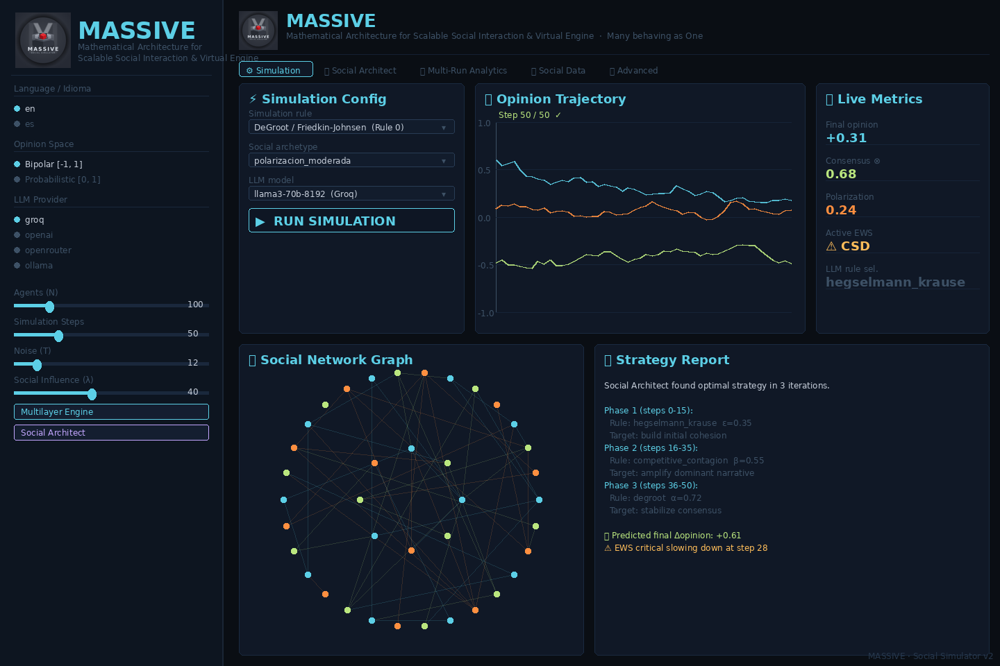

# MASSIVE
### Mathematical Architecture for Scalable Social Interaction & Virtual Engine

> *"Many behaving as One"*

<p align="center">
  
</p>

[](https://www.apache.org/licenses/LICENSE-2.0)
[](https://github.com/Adlgr87/MASSIVE/actions/workflows/pytest.yml)
[](https://github.com/Adlgr87/MASSIVE/actions/workflows/mkdocs.yml)
[](https://github.com/Adlgr87/MASSIVE/actions/workflows/pvu-validation.yml)



### Últimas integraciones aplicadas

- Nueva imagen de referencia de la UI actual de MASSIVE (`docs/massive_ui_mockup.png`).
- Integración del logo del proyecto en el encabezado del simulador Streamlit (`app.py`).
- Motor multicapa sociodemográfico, Arquitecto Social (ingeniería inversa), motor de paisaje energético, modelos extendidos (Nash, Bayesiano, SIR), base de calibración empírica (43 parámetros) y módulo de simulación cuántica totalmente integrados.

Modernized assets joined overlays, refreshed interface tuning yielded reliable experience; polished outputs reflect today.

Simulador híbrido de dinámica social — Núcleo numérico + LLM como selector de régimen. Diseñado para escalar desde un puñado de agentes hasta millones.

MASSIVE cierra la brecha entre los modelos matemáticos clásicos de formación de opinión y la flexibilidad contextual de los Modelos de Lenguaje de Gran Escala (LLMs). Su arquitectura está concebida para mantenerse computacionalmente manejable tanto al estudiar una comunidad pequeña como al simular redes sociales a escala poblacional.

En el corazón de MASSIVE se encuentra el **Arquitecto Social** — un agente LLM de ingeniería inversa que calcula la secuencia precisa de intervenciones matemáticas necesarias para llevar cualquier red social hacia el resultado deseado. En lugar de predecir hacia dónde *irá* una red, el Arquitecto Social determina exactamente *cómo llegar* adonde quieres ir.

Cada individuo ya no es un escalar de opinión, sino un **vector de estado multidimensional** que codifica comportamientos simultáneos — cooperación, reconocimiento de jerarquía, ingreso, acceso a información — evolucionando en paralelo sobre tres capas de red superpuestas (social, digital, económica) moduladas por atributos sociodemográficos fijos como religión, educación y edad. A escala poblacional, los agentes se organizan en clústeres estadísticamente representativos que preservan las dinámicas sociales emergentes mientras reducen memoria y cómputo en órdenes de magnitud.

## ¿Por Qué MASSIVE?

¿Te has preguntado qué podría desencadenar una huelga masiva, o cómo un escándalo podría hundir la aprobación de un político? MASSIVE te permite simular estas dinámicas de una manera fundamentada en matemáticas pero impulsada por la intuición de la IA. No se trata solo de predecir el caos—es ayudarte a entender e incluso dirigir las mareas sociales.

## Escenarios en Acción

Vamos a sumergirnos en algunos escenarios hipotéticos donde MASSIVE brilla. Cubriremos tanto el **Modo Simulación** (predicción hacia adelante) como el **Arquitecto Social** (ingeniería inversa).

### Escenario 1: La Huelga Laboral Inminente

Imagina un piso de fábrica donde los trabajadores están cada vez más frustrados con las decisiones de la gerencia. Opinión inicial: neutral (0.5), pero la propaganda de los sindicatos empuja hacia el disentimiento (-0.3 en rango bipolar).

- **Modo Simulación:** Ejecuta una simulación de 50 pasos con HK (confianza acotada) como régimen. El selector LLM podría cambiar a "contagio_competitivo" cuando dos narrativas (sindicato vs. empresa) compiten. Observa cómo se forman clusters, y las señales EWS advierten de puntos de inflexión inminentes. Resultado: La polarización aumenta, prediciendo el estallido de una huelga.

- **Arquitecto Social:** Entrada: "Prevenir la huelga fomentando el consenso." El ingeniero inverso genera un horario de intervenciones: Comienza con homofilia para construir cohesión grupal, luego cambia a memoria para estabilidad. Salida: Un plan por fases con nodos objetivo (e.g., trabajadores influyentes) para redirigir la energía hacia la negociación.

### Escenario 2: La Caída del Político Corrupto

Un candidato comienza con alta aprobación (0.8), pero las acusaciones de corrupción se filtran como propaganda negativa (-0.6).

- **Modo Simulación:** Usa umbral_heterogeneo para cascadas. El sistema podría detectar alta varianza vía EWS, indicando desaceleración crítica. A medida que se cruzan umbrales, las opiniones avalanchan hacia el rechazo, simulando una caída rápida en desgracia.

- **Arquitecto Social:** Meta: "Estabilizar el apoyo a pesar del escándalo." Modo inverso: Prueba iterativamente regímenes como backlash (reforzar oposición) o polarización para profundizar divisiones. Resultado: Una estrategia que enfatiza el sesgo de confirmación para mantener lealistas, con targeting corporativo de donantes clave.

### Escenario 3: El Movimiento de Protesta Viral

Una protesta impulsada por redes sociales comienza pequeña (opinión 0.6 en apoyo), amplificada por cámaras de eco.

- **Modo Simulación:** Hegselmann-Krause crea clusters naturales. El contagio competitivo modela hashtags rivales. TDA detecta cambios topológicos a medida que el movimiento gana impulso, pronosticando escalada.

- **Arquitecto Social:** Objetivo: "Amplificar el movimiento a nivel nacional." Genera intervenciones: Impulsa con contagio_competitivo para propagación narrativa, targetea influencers macro. Salida: Cronograma de "eventos virales" como temas trending, con narrativas sociológicas generadas por LLM.

Estos son solo inicios—mezcla parámetros, rangos y LLMs para explorar. MASSIVE convierte modelos abstractos en insights tangibles.

## Fundamentos Teóricos e Investigación

El proyecto se inspira en modelos fundamentales de dinámica de opinión y en investigación de vanguardia.

### Modelos Base (Dinámica de Opinión)

- **Modelos de DeGroot y Friedkin-Johnsen:** Implementación base para la evolución de opiniones en redes sociales, considerando la influencia de vecinos y la resistencia al cambio (prejuicios).
- **Hegselmann-Krause (2002) - Confianza Acotada:** El agente solo interactúa con grupos cuya opinión se encuentra dentro de un radio `ε`, propiciando polarización natural y formación de clusters.
- **Contagio Competitivo (Beutel et al., 2012):** Modela la propagación de dos narrativas rivales compitiendo simultáneamente en el sistema.
- **Umbral Heterogéneo (Granovetter, 1978):** Uso de una distribución normal de umbrales en la población en lugar de uno estático, propiciando fenómenos de cascadas sociales rápidas.
- **Redes Co-evolutivas y Homofilia (Axelrod, 1997):** La intensidad de la influencia varía según la similitud de las opiniones, lo que genera cámaras de eco (echo chambers) endógenas.
- **Ecuación Replicadora — Teoría de Juegos Evolutiva (Taylor & Jonker, 1978):** Las frecuencias de estrategia evolucionan según el pago relativo mediante la ODE replicadora integrada con RK45.
- **Sesgo de Confirmación:** Un mecanismo transversal cognitivo que atenúa sistemáticamente el peso de la información contraria a la creencia actual del agente.
- **Dinámica de Energía de Langevin:** Ecuaciones diferenciales estocásticas de inspiración física donde los agentes se mueven a través de un paisaje de energía social configurable con atractores y repulsores — el núcleo de simulación de MASSIVE.
- **Langevin Multicapa Sociodemográfica:** Extensión vectorial de la dinámica de Langevin a cinco comportamientos simultáneos por agente `(opinión, cooperación, jerarquía, ingreso, acceso_info)`, sobre tres capas de red superpuestas (social, digital, económica), con modulación de ruido por atributos demográficos fijos (religión, educación, edad, género). El potencial social multidimensional genera patrones emergentes: polarización de opiniones coexistiendo con clustering de cooperación y estratificación de jerarquía.

### Modelos Extendidos

Tres reglas de simulación adicionales (reglas 10–12 en `extended_models.py`) amplían el vocabulario matemático del Arquitecto Social y del simulador tradicional:

- **Equilibrio de Nash — Teoría de Juegos (Nash, 1950):** Regla 10. Modela equilibrios de estrategias mixtas estables entre grupos sociales. En cada paso, se construye una matriz de pagos 2×2 a partir del alineamiento de opinión con cada grupo, y la estrategia mixta de Nash determina los pesos de membresía. Calculado con `nashpy` (enumeración de soporte) con fallback analítico para juegos 2×2.

- **Red Bayesiana de Opinión (Pearl, 1988):** Regla 11. Una red bayesiana discreta (construida con `pgmpy`) con nodos `Propaganda → Opinion ← Confianza, PresionSocial`. La evidencia observada se discretiza en 3 estados; la Eliminación de Variables devuelve la distribución posterior de opinión. La media posterior se mapea de vuelta al espacio continuo de opinión. Hace fallback a un modelo conjugado Beta-Binomial cuando `pgmpy` no está disponible.

- **Contagio Epidemiológico SIR (Kermack & McKendrick, 1927):** Regla 12. Trata la adopción de opiniones como una epidemia: Susceptibles (pueden ser influenciados), Influenciados (adoptaron la opinión), Resistentes (inmunes a cambios adicionales). La propaganda amplifica la tasa de contacto efectiva `β`. El sistema ODE del SIR se integra con `scipy.integrate.solve_ivp` (RK45) en cada paso.

### Arquitectura Híbrida

A diferencia de simulaciones puramente numéricas, MASSIVE utiliza un LLM (como Llama 3) para analizar la trayectoria histórica y decidir qué régimen matemático es sociológicamente apropiado. El selector heurístico de fallback enruta inteligentemente entre las 13 reglas disponibles (0–12) según las condiciones del estado.

**Conexión Académica:** El enfoque de MASSIVE resuena con investigaciones recientes como *"Opinion Consensus Formation Among Networked Large Language Models"* (Enero 2026), explorando cómo agentes inteligentes forman opiniones en redes.

### Base de Calibración Empírica

Modelar fenómenos sociales complejos requiere anclar las simulaciones en parámetros reales y medibles.  
Académicamente, la psicología, la ciencia política y la teoría de redes proporcionan los cimientos de esta base empírica.  
Juntos, más de 40 estudios revisados por pares respaldan cada parámetro, con metadatos de varianza cultural incluidos.  
Operar con dinámicas de opinión aisladas de datos empíricos produce resultados matemáticamente elegantes pero sociológicamente huecos.  
Radicar el simulador en estos índices de calibración lo transforma de laboratorio teórico a herramienta de investigación aplicada.  
Indicadores de deriva algorítmica, influencia parasocial, sesgo de confirmación, decaimiento temporal y pagos de teoría de juegos están precargados.  
Todos ellos conforman una base empírica viva que los investigadores pueden ampliar añadiendo parámetros o actualizando varianzas culturales.  
Ya integrados, estos parámetros convergen en un espectro bipolar normalizado listo para informar cada paso de simulación.  
Resulta posible consultar el diccionario maestro en tiempo de ejecución para inspeccionar fuentes, citas y niveles de confianza por parámetro.  
El anclaje empírico impide que el simulador derive hacia la especulación pura, manteniendo sus resultados interpretables y falsificables.  
Proporcionar esta capa de responsabilidad empírica es lo que distingue a MASSIVE de un simple sandbox matemático.  
Otras comunidades culturales — nórdica, del sur de Asia, de Medio Oriente — recibirán estimaciones localizadas en versiones futuras.  
Restantes brechas están marcadas con la etiqueta `pending_empirical_data`, haciendo explícitos los límites del conocimiento actual.  
Transparencia sobre la incertidumbre es, en última instancia, la forma más honesta de modelado científico.

El diccionario maestro (`empirical_calibration.py`) consolida 43 parámetros que abarcan dinámica de redes, decaimiento temporal y pagos de teoría de juegos, todos normalizados al espectro bipolar `[-1.0, 1.0]` utilizado por todas las reglas de simulación. Se rastrean seis bloques culturales — latino, anglosajón, asiático oriental, del sur de Asia, de Medio Oriente y nórdico — y cada parámetro puede llevar valores de varianza específicos por bloque. Los índices de calibración se cargan al inicio mediante `empirical_config.py`, que expone el diccionario maestro y un indicador `EMPIRICAL_BASE_LOADED` para los consumidores posteriores. Los parámetros sin consenso empírico se etiquetan explícitamente como `pending_empirical_data`.

## Motor Multicapa Sociodemográfico

Mientras el Motor de Paisaje Energético opera sobre opiniones escalares, el **Motor Multicapa** (`multilayer_engine.py`) eleva cada agente a un vector de estado de cinco dimensiones que captura simultáneamente sus distintos roles en la dinámica social:

```
x_i(t) = (opinion_i, cooperation_i, hierarchy_i, income_i, info_access_i)
```

### Arquitectura de tres capas

Tres matrices de adyacencia diferenciadas modelan los espacios de interacción que un individuo habita en paralelo:

| Capa | Modelo de red | Fenómeno que captura |
|------|---------------|---------------------|
| **Social** | Watts-Strogatz (mundo pequeño) | Contactos cara a cara, comunidad local |
| **Digital** | Barabási-Albert (libre de escala) | Redes sociales, medios virales, cámaras de eco |
| **Económica** | Jerárquica (estrella + hubs) | Flujo de autoridad, mercado laboral, salarios |

Los pesos de cada capa (`w_social`, `w_digital`, `w_economic`) son configurables desde la interfaz, permitiendo explorar escenarios donde la influencia digital supera a la comunitaria o donde la jerarquía económica domina la formación de opinión.

### Modulación sociodemográfica (theta_matrix)

Cada agente tiene atributos fijos que modulan su sensibilidad al ruido y a las señales de cada dimensión:

```python
theta[i, opinion]     *= 1 + 0.5 * religion_i    # religiosos: más sensibles moralmente
theta[i, cooperation] *= 1 + 0.3 * education_i   # educados: mayor tendencia cooperativa
theta[i, hierarchy]   *= 1 + 0.4 * (age_i / 2)  # mayores: más deferencia a la autoridad
```

Esta modulación produce heterogeneidad realista: dos agentes con la misma posición de opinión inicial divergen a distintas tasas según su perfil demográfico, replicando la variabilidad observada en encuestas y estudios de campo.

### Potencial social multidimensional

El gradiente ∇U(x) actúa sobre las cinco dimensiones con dinámicas independientes pero acopladas:
- **Opinión**: doble pozo (polarización emergente hacia ±0.7)
- **Cooperación**: atracción hacia el nivel de alineación social del agente
- **Jerarquía**: bifurcación hacia los extremos (rebelde ↔ conformista)
- **Ingreso**: centrado con fricción proporcional al nivel jerárquico
- **Acceso info**: decaimiento lento modulado por la cooperación

### Aceleración Numba

El kernel de integración (`multilayer_langevin_step`) está compilado con `@njit` de Numba. En la primera llamada se compila una sola vez; las siguientes son de velocidad nativa. Para N=200 agentes, 1000 pasos se completan en menos de 5 segundos en hardware estándar.

### Uso programático

```python
from multilayer_engine import MultilayerEngine

engine = MultilayerEngine(
    N=200,
    layer_weights=(0.4, 0.3, 0.3),   # social, digital, económica
    coupling=0.3,
    attr_config={"religion_prob": 0.35, "age_dist": (0.25, 0.45, 0.30)},
)
history = engine.run(steps=500)

# Trayectorias por grupo etario
traj_df = engine.trajectories_by_attribute("age_group")

# Correlaciones entre los 5 comportamientos
corr = engine.behavior_correlation_matrix()

# Métricas del paisaje social final
landscape = engine.get_landscape()
```

La configuración predeterminada de capas y atributos se puede personalizar sin tocar código a través de `configs/multilayer.yaml`.


El **Motor de Paisaje Energético** de MASSIVE modela la dinámica social como un sistema físico donde la opinión de cada agente evoluciona según una ecuación diferencial estocástica de Langevin:

```
x_i(t+η) = x_i(t) − η·∇U(x_i) + η·λ·(x̄_vecinos − x_i) + √(2η·T)·ε
```

| Término | Significado |
|---|---|
| `∇U(x)` | Gradiente del paisaje de energía social (atractores/repulsores) |
| `λ` (`lambda_social`) | Balance: 0 = solo paisaje, 1 = solo influencia de red social |
| `T` (`temperature`) | Ruido / libre albedrío — mayor = comportamiento individual más caótico |
| `ε ~ N(0,1)` | Término estocástico (integración Euler-Maruyama) |

Los **Atractores** modelan fuerzas de cohesión social (puntos de consenso, identidades faccionales, posiciones oficiales). Los **Repulsores** modelan fuerzas de división social (aversión a la moderación, dinámicas anti-consenso). Todos los parámetros se validan mediante esquemas Pydantic v2 `EnergyConfig` antes de ejecutar cualquier simulación.

### Arquetipos Sociales Pre-construidos

El **Arquitecto Programático** (`programmatic_architect.py`) incluye 8 arquetipos validados que cubren los escenarios sociológicos más comunes:

| Clave del arquetipo | Descripción |
|---|---|
| `polarizacion_extrema` | Dos bandos irreconciliables. El centro es tierra de nadie. |
| `polarizacion_moderada` | Dos grupos, pero con diálogo posible en el centro. |
| `consenso_moderado` | La sociedad tiende a acuerdos. El centro atrae a todos. |
| `consenso_forzado` | Presión institucional fuerte hacia una sola posición. |
| `fragmentacion_3_grupos` | Tres facciones que coexisten sin fusionarse. |
| `fragmentacion_4_grupos` | Cuatro comunidades tribales con alta segmentación. |
| `caos_social` | Sin estructura clara. Cada agente actúa por impulso propio. |
| `radicalizacion_progresiva` | Los agentes empiezan al centro y son jalados hacia los extremos. |

**Pipeline de resolución** — para cualquier objetivo en texto libre, el motor intenta en orden:
1. **Coincidencia exacta de arquetipo** (instantáneo, sin llamada API)
2. **Caché RAM** (submilisegundo, mismo proceso)
3. **Caché SQLite** (`LandscapeCache`) — persiste entre sesiones de Streamlit y reinicios de contenedor
4. **Generación LLM one-shot** (Groq / OpenAI / OpenRouter / Ollama) con validación Pydantic
5. **Fallback** a `caos_social` si el LLM falla o devuelve una configuración inválida

## Arquitecto Social (Ingeniería Inversa)

MASSIVE introduce al **Arquitecto Social**, un potente agente de ingeniería inversa apoyado en un bucle *LLM-in-the-loop*. En lugar de simplemente predecir el futuro de la red, tú defines el resultado sociológico que deseas (p. ej., *"Lograr un consenso moderado y eliminar la polarización en 20 iteraciones"*), y el Arquitecto Social trabaja hacia atrás para encontrar la estrategia exacta que te lleva allí.

### Cómo Funciona

1. **Definición del objetivo:** Describes en lenguaje natural el estado final deseado — consenso, polarización, propagación viral, contención de crisis, alineación cultural, etc.
2. **Bucle de simulación iterativo:** El agente LLM propone una `StrategyMatrix` — un calendario de intervenciones matemáticas por fases (HK, contagio, homofilia, umbrales…). El simulador ejecuta el calendario y puntúa el resultado.
3. **Autocrítica y refinamiento:** Si la puntuación no alcanza el objetivo, el agente recibe feedback estructurado (nivel de polarización, delta de opinión, varianza) y propone una estrategia mejorada. Se ejecutan automáticamente hasta `N` rondas de refinamiento.
4. **Generación de narrativa:** Una vez hallada la estrategia óptima, una segunda llamada al LLM traduce los parámetros matemáticos a un informe sociológico o ejecutivo legible — campañas, palancas de política, acciones organizacionales — adaptado al modo operativo elegido.

### Modos Operativos

| Modo | Dominio | Vocabulario |
|---|---|---|
| **Macro** | Política, redes sociales masivas, polarización pública | Campañas mediáticas, hashtags virales, cámaras de eco, polarización electoral, nodos influyentes |
| **Corporativo** | RRHH, cambio organizacional, liderazgo interno | Sesiones 1:1, reuniones interdepartamentales, comunicación top-down, planes 30-60-90 días, alineación con OKRs |

En el **Modo Corporativo**, el Arquitecto Social identifica a los líderes informales (alta centralidad de intermediación) como objetivos prioritarios de intervención, generando planes de acción específicos para la organización en lugar de estrategias mediáticas.

### Salida Clave: `StrategyMatrix`

El Arquitecto Social devuelve una `StrategyMatrix` validada — un calendario de intervenciones estructurado que indica, para cada ventana temporal: el régimen matemático, sus parámetros de ajuste, los nodos objetivo (opcional) y una justificación en lenguaje natural para esa fase. Este calendario puede exportarse, reproducirse en el simulador o usarse como hoja de ruta para una campaña real.

> **Ejemplo de objetivo →** *"Estabilizar la aprobación de los empleados durante una reestructuración organizacional."*
> **Salida →** Un plan de 3 fases: primero cohesión basada en homofilia entre líderes de equipo, luego un régimen de memoria para estabilizar, y finalmente un impulso de comunicación top-down focalizado — con una narrativa de RRHH completa que explica cada fase en lenguaje consultivo.

### Integración con LangChain

Cuando el toggle **⛓️ Usar LangChain** está activo en la barra lateral, tanto el Arquitecto Social como el Arquitecto Programático enrutan sus llamadas LLM a través de cadenas LangChain tipadas (`langchain_workflows.py`) en lugar de peticiones HTTP directas. Beneficios:

- **Parseo tipado de salida** — `JsonOutputParser` detecta JSON malformado antes de que llegue al simulador.
- **Agnóstico al proveedor** — soporta `groq` (vía `langchain-groq`), `openai`, `openrouter` y `ollama` a través de la misma interfaz de cadena.
- **Cadenas componibles** — `strategy_chain`, `narrative_chain` y `landscape_chain` pueden extenderse con memoria, herramientas o ejecutores de agentes en el futuro.

## Instalación

```bash
pip install -r requirements.txt
```

## Ejecución

### Modo Local (Streamlit)
```bash
streamlit run app.py
```

### Ejecución en Hugging Face Spaces
Este repositorio está listo para ser desplegado como un **Hugging Face Space**. Simplemente conecta este repo a un nuevo Space de tipo `Streamlit`.

## Integración con Redes Sociales

MASSIVE puede inicializar simulaciones con **datos de opinión reales** obtenidos en vivo desde Twitter/X o Reddit. Configura las credenciales en la barra lateral bajo **🌐 Datos de Redes Sociales**.

### Twitter / X

Requiere un **Bearer Token** (Portal de Desarrolladores de Twitter → Proyecto → App → Keys & Tokens).

El conector consulta la [API de Búsqueda Reciente de Twitter v2](https://developer.twitter.com/en/docs/twitter-api/tweets/search/introduction), aplica análisis de sentimiento por palabras clave, y devuelve la opinión media ponderada — lista para usarse como estado inicial en cualquier simulación.

### Reddit

Requiere una **aplicación de tipo script** registrada en [reddit.com/prefs/apps](https://www.reddit.com/prefs/apps).

El conector usa `praw` para buscar en un subreddit, puntúa el sentimiento de cada publicación, pesa por el score de Reddit y devuelve una distribución de opiniones de la comunidad.

Ambos conectores funcionan con rangos **bipolar** `[-1, 1]` y **unipolar** `[0, 1]`. Puedes configurar las credenciales mediante variables de entorno:

```env
TWITTER_BEARER_TOKEN=xxx
REDDIT_CLIENT_ID=xxx
REDDIT_CLIENT_SECRET=xxx
```

## Optimización de Rendimiento

### Numba — Motor Langevin Acelerado con JIT

El `SocialEnergyEngine` en `energy_engine.py` usa **Numba** para compilar en JIT el bucle interno del paso Langevin vía `@njit`. En la primera llamada, el kernel se compila una sola vez; todas las llamadas posteriores son de velocidad nativa (típicamente 5–20× más rápido que NumPy puro para muchos agentes). Numba hace fallback elegante con un decorador no-op cuando no está instalado.

### Dask — Simulaciones Múltiples en Paralelo

El toggle **⚡ Paralelizar con Dask** activa `simular_multiples_dask()`, que envuelve cada una de las N simulaciones en una tarea `dask.delayed` y las ejecuta de forma concurrente en todos los núcleos CPU disponibles. Para N=100 simulaciones, esto típicamente proporciona una aceleración de 3–8× en máquinas multi-núcleo. Hace fallback a `simular_multiples()` secuencial cuando Dask no está disponible.

## Escala — Millones de Agentes en Hardware Doméstico

`massive_engine.py` gestiona las demandas computacionales de la simulación a escala poblacional mediante cuatro estrategias integradas, permitiendo corridas con millones de agentes en un portátil — sin necesidad de clúster GPU.

### Estrategia 1 — LOD Sociológico (Super-Agentes)

Inspirado en el renderizado por Nivel de Detalle de los videojuegos: en lugar de simular N agentes individuales, el motor los agrupa en **M super-agentes** (clústeres). Solo se evolucionan M << N centros mediante las ecuaciones de Langevin; cada centro representa un grupo de agentes con perfil socio-psicológico similar.

| N agentes | M clústeres (auto) | Tamaño de matriz | RAM (float64) |
|---|---|---|---|
| 10 000 | 100 | 100×100 | ~0.08 MB |
| 100 000 | 316 | 316×316 | ~0.8 MB |
| 1 000 000 | 1 000 | 1000×1000 | ~8 MB |

El método `apply_shock()` permite inyectar perturbaciones externas (noticias virales, shocks económicos) que reactivan clústeres dormidos y se propagan por la red.

### Estrategia 2 — Cuantización de Estado (personalidades en uint8)

Los parámetros de estado se almacenan como enteros sin signo de 8 bits (0–255) en lugar de flotantes de 64 bits, reduciendo la RAM en un **87.5%** por parámetro. La precisión resultante (≈ 0.008 por unidad de rango de opinión) es suficiente para representar diferencias socialmente relevantes.

```python
# Antes: float64 — 8 bytes/parámetro
opinion_naive = 0.857432   # 8 bytes

# Después: uint8 — 1 byte/parámetro
opinion_quant = 219         # 1 byte  → descuantizar → 0.856...
```

Combinado con LOD, la reducción neta de memoria para N=1M agentes supera el **99.99%**.

### Estrategia 3 — Simulación Dirigida por Eventos (Gossip Sparsity)

En la dinámica social real, no todos cambian de opinión en cada momento. La clase `ActiveSet` rastrea qué super-agentes están "despiertos" según si su estado cambió más de un umbral configurable (`sleep_threshold`).

- Los agentes cuyos vecinos cambiaron significativamente se reactivan automáticamente.
- Los agentes en consenso estable permanecen congelados — costo CPU cero hasta ser perturbados.
- `active_history` muestra la fracción de super-agentes activos por paso.

### Estrategia 4 — GPU Offloading

Las operaciones matriciales se delegan a GPU cuando **CuPy** o **PyTorch+CUDA** están disponibles. El camino de fallback (Numba JIT en CPU) funciona sin configuración en cualquier máquina.

### API programática

```python
from massive_engine import MassiveSimEngine

engine = MassiveSimEngine(
    N=1_000_000,
    quantize=True,
    event_driven=True,
    sleep_threshold=5e-3,
    layer_weights=(0.4, 0.3, 0.3),
    coupling=0.3,
    dt=0.01,
    seed=42,
)

result = engine.run(steps=300)
print(f"Ahorro RAM:     {result['memory_savings_pct']:.1f}%")   # ≈ 99.99%
print(f"Opinión media:  {result['mean_opinion']:+.3f}")
print(f"Velocidad:      {result['steps_per_second']:.0f} pasos/s")

# Aplicar shock externo al 20% de la red
engine.apply_shock(shock_value=0.4, fraction=0.2)
result2 = engine.run(steps=100)
```


## Protocolo de Uso Validado (PVU-BS)

MASSIVE incluye un **protocolo de validación formal** que establece el estándar mínimo de evidencia para afirmar que el sistema ofrece desempeño predictivo validado sobre datos reales de dinámica de opinión.

### Conceptos clave

| Concepto | Descripción |
|---------|-------------|
| **Caso independiente** | Tupla `{red, serie_temporal, intervenciones, metadatos}` donde las redes comparten < 10 % de nodos y las ventanas temporales no coinciden con shocks globales no modelados. Los casos que comparten un confundidor reciben un `cluster_id`. |
| **Variable objetivo** | Compuesta: **Índice de Polarización P(t)** (varianza + extremidad) + **Habilidad en Puntos de Giro** (F1 en transiciones de régimen). |
| **Anti-leakage** | Las métricas del test nunca deben verse antes de congelar la configuración del modelo. Reglas completas en [docs/validation/PVU_BeyondSight_ES.md](docs/validation/PVU_BeyondSight_ES.md). |
| **Estadística** | Test de Diebold–Mariano + corrección **Holm–Bonferroni** para múltiples baselines × casos. Los tamaños de efecto (ΔMAE, ΔRMSE, TPS F1) son obligatorios junto con los p-valores. |
| **Muestra vs real** | `datasets/pvu_cases/sample_case_*` son **sintéticos** — solo para pruebas del pipeline. La validación PVU real requiere N ≥ 10 casos independientes del mundo real. |

### Ejecutar el benchmark

```bash
# Modo offline (sin clave de API — por defecto en CI):
PYTHONHASHSEED=42 python -m benchmarks.runner \
    --cases datasets/pvu_cases --offline \
    --out reports/validation/ci --seed 42

# Modo LLM (requiere OPENROUTER_API_KEY o OPENAI_API_KEY):
PYTHONHASHSEED=42 python -m benchmarks.runner \
    --cases datasets/pvu_cases --llm \
    --out reports/validation/llm_run --seed 42
```

Documentación completa del protocolo: [Español](docs/validation/PVU_BeyondSight_ES.md) · [English](docs/validation/PVU_BeyondSight_EN.md)

---

## Estructura del Proyecto

```
MASSIVE/
├── benchmarks/                   # Runner offline de benchmark PVU-BS
│   ├── runner.py                 # Punto de entrada CLI (python -m benchmarks.runner)
│   ├── baselines.py              # Naive, MA, AR(1), Régimen aleatorio
│   ├── metrics.py                # MAE/RMSE/MAPE, Diebold–Mariano, Holm–Bonferroni
│   ├── turning_points.py         # Detección de puntos de giro y scoring F1
│   └── io.py                     # Cargador de casos PVU
├── configs/
│   ├── multilayer.yaml               # Configuración de capas y atributos sociodemográficos
│   └── pvu.yaml                  # Configuración del runner (ratios, umbrales, semillas)
├── datasets/
│   └── pvu_cases/                # Carpetas de casos PVU (sample_case_001, sample_case_002, …)
├── docs/
│   └── validation/               # Protocolo PVU-BS bilingüe y plantillas (EN/ES)
├── reports/
│   └── validation/               # Salidas del benchmark (metrics.json, report.md)
├── tests/                        # Pruebas unitarias e integración
│   ├── test_energy_core.py       # Suite de pruebas del motor energético (42 tests)
│   ├── test_game_theory.py       # Pruebas de la capa de Teoría de Juegos estratégica
│   ├── test_integration_llm.py   # Pruebas de integración del selector LLM
│   ├── test_massive_engine.py    # Suite del motor masivo (42 tests)
│   ├── test_multilayer.py        # Suite de pruebas del motor multicapa (27 tests)
│   ├── test_pvu_runner.py        # Pruebas del runner de benchmark PVU
│   ├── test_simulator.py         # Pruebas del núcleo simulador
│   ├── test_social_architect.py
│   └── test_visualizations.py
├── docs/                         # Fuentes de documentación MkDocs
├── .env.example                  # Plantilla de variables de entorno
├── .gitignore
├── app.py                        # Interfaz Streamlit (4 tabs: Simulación, Arquitecto, Multicapa, Masiva)
├── cache_manager.py              # Caché RAM + SQLite para paisajes sociales
├── empirical_calibration.py      # Diccionario maestro de calibración empírica (43 parámetros)
├── empirical_config.py           # Cargador de calibración — indicador EMPIRICAL_BASE_LOADED
├── energy_engine.py              # Motor de dinámica de Langevin (acelerado con Numba)
├── energy_runner.py              # Orquestador de simulaciones Langevin
├── energy_schemas.py             # Esquemas Pydantic v2 para EnergyConfig
├── extended_models.py            # Reglas extendidas: Nash (10), Red Bayesiana (11), SIR (12)
├── i18n.py                       # Ayudantes de internacionalización
├── langchain_workflows.py        # Cadenas LangChain para Arquitectos Social y Programático
├── massive_engine.py             # Motor de Escala Masiva: LOD, cuantización uint8, event-driven, GPU
├── multilayer_engine.py          # Motor Multicapa Sociodemográfico (vector 5D + 3 capas + theta)
├── programmatic_architect.py     # Arquitecto Programático (arquetipos + caché + LLM)
├── README.md                     # Documentación (inglés)
├── README_ES.md                  # Documentación (español)
├── requirements.txt              # Dependencias
├── schemas.py                    # Esquemas Pydantic para StrategyMatrix y Teoría de Juegos
├── simulator.py                  # Núcleo: 13 reglas, EWS, TDA, paralelo Dask, lógica LLM
├── social_architect.py           # Agente de ingeniería inversa Arquitecto Social
├── social_connectors.py          # Conectores de API Twitter/X y Reddit (datos empíricos en vivo)
├── utility_logic.py              # Calculador de fuerza estratégica de Teoría de Juegos
└── visualizations.py             # Ayudantes de visualización de red
```

## Licencia

Este proyecto está bajo la **Apache License 2.0** — libre para uso personal, académico y comercial con atribución al autor.

La lógica, estructura, variables y diseño del sistema pertenecen a [Adlgr87](https://github.com/Adlgr87). El código es de código abierto para que cualquiera pueda usarlo, modificarlo y construir sobre él — crédito siempre bienvenido.

Para consultas sobre consultoría o colaboraciones, contactar a [Adlgr87](https://github.com/Adlgr87) en GitHub.

---
*Many behaving as One.*
