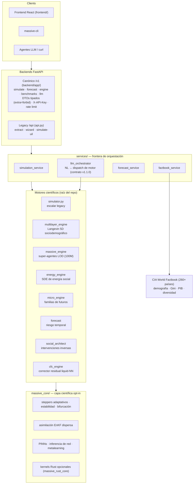

<div align="center">

# MASSIVE

**Mathematical Architecture for Scalable Social Interaction & Virtual Engine**

*Plataforma híbrida física + IA que simula formación de opinión, polarización y
resultados de intervenciones sobre sistemas sociales complejos — de 10 agentes a 100 millones.*

[](LICENSE)
[](pyproject.toml)
[](.github/workflows/pytest.yml)
[](.github/workflows/typecheck.yml)
[](Cargo.toml)

[Inicio rápido](#-inicio-rápido) · [Arquitectura](#-arquitectura) · [API](#-api-http) · [Capa LLM](#-la-capa-llm-lenguaje-natural--matemáticas) · [Benchmarks](#-benchmarks) · [Documentación](#-documentación)

</div>

---

## Qué hace diferente a MASSIVE

La mayoría de los simuladores sociales obligan a elegir entre escala, rigor científico y usabilidad.
MASSIVE es **híbrido por diseño** en cada capa:

| Vanguardia | Qué hacemos | Dónde |
|---|---|---|
| 🌍 **Escala poblacional por compresión LOD** | Agentes con features idénticas colapsan en *super-agentes*: **100 millones de agentes en ~8 GB de RAM** — memoria casi constante con actualizaciones dispersas event-driven y cuantización uint8. | `massive_engine.py` |
| 🤖 **LLM como *traductor matemático*, no chatbot** | Lenguaje natural → configuración validada bajo un **contrato versionado legible por máquina** (v1.1.0): la clasificación del intent enruta al motor correcto, las peticiones ambiguas devuelven `422 + requested_fields`, y todo corre **determinísticamente sin ninguna API key**. | `services/llm_orchestrator.py`, `configs/llm_contract/` |
| 🧠 **Corrección residual con redes líquidas** | Una red Closed-form Continuous-time (CfC) aprende el *sesgo sistemático* del motor físico y lo corrige — **50 % de reducción del error de dirección** en el caso del Brexit (10/10 semillas mejoraron). | `cfc_engine.py`, `models/cfc_calibrated/` |
| 📡 **Asimilación de datos para dinámicas de opinión** | Un Ensemble Kalman Filter disperso fusiona observaciones reales con el estado en ejecución, como la predicción numérica del clima. | `massive_core/data_assimilation/` |
| ⚗️ **Capa científica opt-in** | Steppers adaptativos, análisis de estabilidad y bifurcación, PINNs, inferencia de redes y mecánica estadística — tras flags explícitos que nunca alteran la dinámica por defecto. | `massive_core/` |
| 🧬 **Diseño inverso de intervenciones** | Pregunta *"¿qué campaña alcanza este consenso?"* — el arquitecto social busca el espacio de intervenciones hacia atrás desde el objetivo. | `social_architect.py` |
| ⚡ **Kernels Rust opcionales** | Numérica de ruta caliente compilada con pyo3/maturin, con fallbacks transparentes en Python puro. | `rust_core/` → `massive_rust_core` |
| 🔬 **Cultura validation-first** | Protocolo anti-leakage con pre-registro, RNG con semilla en todo el sistema, APIs validadas por contrato, CI de 16 checks, suite PVU offline. | `datasets/pvu_cases/`, `benchmarks/` |

---

## 🚀 Inicio rápido

Verificado desde clonación limpia (Python 3.11+, ~2 min de instalación):

```bash
git clone https://github.com/Adlgr87/MASSIVE.git && cd MASSIVE
python3 -m venv .venv && source .venv/bin/activate
pip install -r requirements.txt
cp .env.example .env          # añade claves LLM/sociales si tienes (opcional)

# API canónica versionada (/v1/*) — docs interactivos en /docs
uvicorn backend.app.main:app --host 0.0.0.0 --port 8000
```

```bash
# Primera simulación en un comando (modo dev acepta la clave fallback documentada)
curl -H "X-API-Key: dev-secret-key" -X POST localhost:8000/v1/simulate \
     -H 'Content-Type: application/json' -d '{"pasos": 30}'
```

O con el CLI, sin servidor:

```bash
python -m massive.cli simulate --pasos 30     # motor escalar + resumen JSON
python -m massive.cli version
```

O en Python puro:

```python
from services.simulation_service import run_multilayer_simulation
result = run_multilayer_simulation(n_agents=100, steps=50, seed=42)
print(result["landscape"])
```

**¿Prefieres Docker?**

```bash
cp .env.example .env
docker compose -f docker-compose.single.yml up -d --build   # API + UI en :8000
curl -fsS localhost:8000/health
```

> Mínimo: Python 3.11, 500 MB RAM. Rust/CUDA/torch/claves LLM son opcionales —
> cada capa opcional tiene un fallback determinista.

---

## 🏗 Arquitectura


```mermaid
flowchart TB
    subgraph Clients
        FE["Frontend React (frontend/)"]
        CLI["massive-cli"]
        AG["Agentes LLM / curl"]
    end

    subgraph API["Backends FastAPI"]
        V1["Canónico /v1 (backend/app/)<br/>simulate · forecast · engine · benchmarks · llm<br/>DTOs tipados (extra=forbid) · X-API-Key · rate limit"]
        LEG["Legacy /api (api.py)<br/>extract · wizard · simulate-uil"]
    end

    subgraph Services["services/ — frontera de orquestación"]
        ORCH["llm_orchestrator<br/>NL → dispatch de motor (contrato v1.1.0)"]
        SIM["simulation_service"]
        FOR["forecast_service"]
        FB["factbook_service"]
    end

    subgraph Engines["Motores científicos (raíz del repo)"]
        direction LR
        E1["simulator.py<br/>escalar legacy"]
        E2["multilayer_engine<br/>Langevin 5D sociodemográfico"]
        E3["massive_engine<br/>super-agentes LOD (100M)"]
        E4["energy_engine<br/>SDE de energía social"]
        E5["micro_engine<br/>familias de futuros"]
        E6["forecast<br/>riesgo temporal"]
        E7["social_architect<br/>intervenciones inversas"]
        E8["cfc_engine<br/>corrector residual liquid-NN"]
    end

    subgraph Core["massive_core/ — capa científica opt-in"]
        C1["steppers adaptativos · estabilidad · bifurcación"]
        C2["asimilación EnKF dispersa"]
        C3["PINNs · inferencia de red · metalearning"]
        C4["kernels Rust opcionales (massive_rust_core)"]
    end

    DATA["CIA World Factbook (260+ países)<br/>demografía · Gini · PIB · diversidad"]

    Clients --> API --> Services --> Engines --> Core
    FB --> DATA
    ORCH --> Engines
```

Invariantes clave:

- **Los motores son el producto** — APIs, CLI y capa LLM son fronteras delgadas y tipadas sobre ellos.
- **Opcional significa opcional**: sin build Rust, sin GPU, sin clave LLM, sin datos Factbook → todo corre deterministicamente (semillas + `PYTHONHASHSEED` respetados).
- **Seguridad fail-closed**: staging/producción se niegan a servir sin `MASSIVE_API_KEY`; la clave fallback de dev se loguea ruidosamente y es imposible en producción.

---

## 📡 API HTTP

**Canónica — `backend.app.main:app`** (recomendada para integraciones nuevas)

| Endpoint | Método | Propósito |
|---|---|---|
| `/v1/simulate` | POST | Simulación escalar (historial + resumen) |
| `/v1/forecast` | POST | Forecast temporal analítico + Monte Carlo |
| `/v1/engine/energy` | POST | Paisaje Langevin de energía social |
| `/v1/engine/architect` | POST | Búsqueda inversa de intervenciones |
| `/v1/benchmarks` | POST | Validación offline PVU-BS |
| `/v1/llm/run_simulation` | POST | **Intent NL → motor → resultado narrado** (contrato v1.1.0) |
| `/health`, `/ready`, `/version` | GET | Liveness · readiness (solo dependencias requeridas) · metadatos |
| `/metrics` | GET | Contadores Prometheus (`http_requests_total`, uptime) |
| `/docs` | GET | UI OpenAPI autogenerada |

**Legacy — `api.py`** (usada por el frontend React; superficie de compatibilidad)

`POST /api/extract` (PDF/CSV/JSON/XLSX → config) · `POST /api/wizard` (LLM) ·
`POST /api/simulate-uil` · `POST /api/v1/{architect,forecast,energy}`

**Defaults operativos**: auth `X-API-Key` (comparación constant-time) · 60 req/min por IP
(`MASSIVE_RATE_LIMIT_PER_MIN`) · límite de body 10 MB (`MASSIVE_MAX_BODY_MB`) ·
CORS sin wildcards · allowlist de extensiones en uploads ·
correlación `X-Request-ID` en cada respuesta · access log estructurado con duración.
Referencia completa de variables: `.env.example` y [`docs/security/secrets-and-configuration.md`](docs/security/secrets-and-configuration.md).

---

## 🤖 La capa LLM: lenguaje natural → matemáticas

`POST /v1/llm/run_simulation` convierte un intent como
*"Simula el paisaje de energía social para Brasil con desigualdad"* en una ejecución
sembrada y validada del motor:

1. **Clasifica** el intent contra el contrato legible por máquina
   (`configs/llm_contract/massive_llm_contract.json`, v1.1.0) → familia de motor.
2. **Protocolo de ambigüedad**: si faltan campos requeridos (p. ej. horizonte del forecast) →
   `422` con `requested_fields` — el agente pregunta al usuario en vez de inventar.
3. **Traduce** NL → config con el LLM (Groq / OpenAI / OpenRouter / Ollama) o,
   **sin clave configurada**, con defaults deterministas documentados.
4. **Aumenta** con parámetros del CIA Factbook al detectar país (Gini →
   profundidad de atractores, PIB → presupuestos de intervención, diversidad → presión social).
5. **Despacha** al motor correcto; devuelve un envelope tipado
   (`sim_id · motor · config · summary · narrative · results{timeline, payload} · assumptions`).

Los flujos intrínsecamente LLM-dependientes (p. ej. el arquitecto inverso) fallan cerrado
con un `503` claro cuando no hay clave — nunca se degradan en silencio.

---

## 📊 Benchmarks

Medidos en el rig de benchmarks del repo (31 GB RAM — ejecuta `benchmark_scalability.py` en tu hardware):

| Motor | 1K agentes | 100K | 1M | 100M |
|---|---|---|---|---|
| **MassiveEngine** (LOD agregado) | 0.39 s · 0.87 GB | 2.3 s · 0.87 GB | 21 s · 0.88 GB | **44 s · 8.3 GB** |
| EnergyEngine | 0.06 s | 3.1 s | 35 s | 16.8 GB requeridos |
| SparseMultilayerEngine | 0.03 s | 6.3 s | 43 s · 1.1 GB | N/A |

Micro-benchmarks de referencia (sandbox 2 vCPU, vía capa de servicios, mín de 3):
escalar 50 pasos **0.029 s** · multilayer 100×50 **0.008 s** · massive LOD 10K×50 **0.023 s** ·
energy 50×100 **0.012 s** — método en [`docs/performance/baseline.md`](docs/performance/baseline.md).

**Validación científica**: el protocolo PVU-MASSIVE corre casos reales offline
(`python -m benchmarks.runner --cases datasets/pvu_cases --offline`), con plantilla de
pre-registro para prevenir leakage de análisis. El corrector CfC calibrado redujo a la mitad
el error de dirección en el caso Brexit (54.5 % → 53.2 % Leave; 10/10 semillas).

---

## 🧪 Calidad y postura de producción

| Señal | Estado |
|---|---|
| Suite de tests | **530 tests, ~38 s**, sin exclusiones — `make test` / `pytest tests/` |
| Cobertura | 68 % branch (alcance: motores + servicios + backend) — `make test-cov` |
| Calidad estática | ruff + black + mypy (slice gradual) verdes en CI |
| CI | 16 checks por PR: lint, tipos, suites core/scientific/api/full, build+lint frontend, salud de Docker compose, sincronía de tipos TS, secret scan, semgrep, benchmark PVU |
| Seguridad | auth fail-closed, rate & body limits, comparaciones constant-time, sin secretos en el árbol (un token histórico documentado + rotación pendiente, ver `docs/security/threat-model.md`) |
| Observabilidad | `/metrics` Prometheus, `X-Request-ID`, access logs estructurados, readiness con modo degradado |
| Runbooks | dev local · operaciones · incidentes — `docs/runbooks/` |

---

## 📁 Estructura del repositorio

```
MASSIVE/
├── backend/app/          # FastAPI canónico (/v1): routers, DTOs, security, metrics
├── services/             # Frontera de orquestación (simulation, forecast, LLM, factbook)
├── massive_core/         # Capa científica opt-in (steppers, EnKF, PINNs, config…)
├── massive/              # CLI + core/factbook (loader, mappings, validator)
├── simulator.py          # Motor escalar legacy (API pública: simular, resumen_historial)
├── multilayer_engine.py  # Dinámica Langevin 5D sociodemográfica
├── massive_engine.py     # Motor LOD de super-agentes (escala poblacional)
├── energy_engine.py      # SDE de paisaje de energía social (Euler–Maruyama)
├── micro_engine.py       # Grupos pequeños, familias de futuros, bifurcación
├── social_architect.py   # Búsqueda inversa de estrategias de intervención
├── forecast/             # Forecast de riesgo temporal
├── cfc_*.py              # Corrector residual CfC (liquid NN): engine, router, trainer
├── rust_core/            # Kernels pyo3 opcionales (massive_rust_core)
├── frontend/             # SPA React 18 + Vite + TS (DTOs tipados generados desde Python)
├── massive-ui-ng/        # Kit UI next-gen (traductor LLM; ver su README)
├── configs/llm_contract/ # Contrato MASSIVE↔LLM legible por máquina (v1.1.0)
├── datasets/pvu_cases/   # Casos de validación offline (pre-registrados)
├── benchmarks/           # Runner PVU-BS + benchmarks científicos
├── docs/                 # Sitio MkDocs + suite de production-readiness
└── tests/                # 530 tests: unit, integración, contrato, seguridad, reproducibilidad
```

---

## 📚 Documentación

| Tema | Enlace |
|---|---|
| Sitio MkDocs (referencia API, validación, ciencia) | `python -m mkdocs serve` → http://localhost:8000 |
| Arquitectura — estado actual (mapa verificado) | [`docs/architecture/current-state.md`](docs/architecture/current-state.md) |
| Arquitectura — estado objetivo y decisiones abiertas | [`docs/architecture/target-state.md`](docs/architecture/target-state.md) |
| Auditoría de production-readiness y matriz de riesgos | [`docs/production-readiness-audit.md`](docs/production-readiness-audit.md) |
| Runbooks (dev · ops · incidentes) | [`docs/runbooks/`](docs/runbooks/local-development.md) |
| Seguridad (modelo de amenazas, secretos) | [`docs/security/threat-model.md`](docs/security/threat-model.md) |
| Estrategia de testing y cobertura | [`docs/testing/test-strategy.md`](docs/testing/test-strategy.md) |
| Baseline de rendimiento | [`docs/performance/baseline.md`](docs/performance/baseline.md) |
| Checklist de release | [`docs/release-checklist.md`](docs/release-checklist.md) |
| README en inglés | [`README.md`](README.md) |

---

## 🤝 Contribuir

Los PRs son bienvenidos — ver [`CONTRIBUTING.md`](CONTRIBUTING.md). En resumen:

```bash
make install && make test && make lint    # los tres verdes antes de abrir un PR
```

Los cambios de comportamiento de motores requieren tests de caracterización antes y
comparaciones numéricas con tolerancia después (ver la estrategia de testing). Los campos
nuevos de API deben regenerar los tipos del frontend (`python scripts/gen_ts_types.py` — CI lo exige).

## 📜 Licencia

Apache License 2.0 — ver [`LICENSE`](LICENSE).

---

<div align="center">

*MASSIVE fue desarrollado previamente como **BeyondSight** (archivado en el historial git). Renombrado el 2026-06-29.*

</div>
