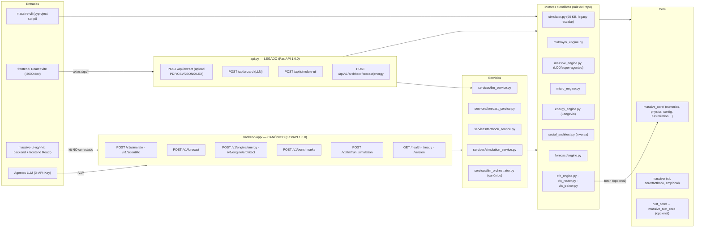

# MASSIVE — Arquitectura: Estado Actual (current-state.md)

> Fecha de inspección: 2026-08-20 · HEAD auditado: `288ba9a` (main) · Rama de trabajo: `arena/01a01fbd-massive`
> Este documento describe el estado **real y verificado** del repositorio, no el deseado.
> Cada afirmación fue comprobada ejecutando comandos en un entorno limpio (Python 3.11.2, Node 22).

---

## 1. Qué es MASSIVE

Plataforma híbrida de simulación de dinámicas sociales (opinión, polarización, energía social,
forecast, optimización inversa de intervenciones) con:

- Núcleo científico Python (numpy/scipy/networkx) + aceleración Rust **opcional** (`massive_rust_core` vía pyo3/maturin).
- Tres "backends" HTTP (ver §3) y **tres UIs** (React `frontend/`, kit `massive-ui-ng/frontend/`, Streamlit documentado pero **inexistente** en el árbol).
- Integraciones LLM (Groq/OpenAI/OpenRouter/Ollama), CIA World Factbook, conectores sociales (Twitter/Reddit), procesamiento de documentos (PDF/CSV/JSON/XLSX).

## 2. Mapa de componentes (verificado)

### 2.1 Puntos de entrada verificados

| Entrada | Estado | Evidencia |
|---|---|---|
| `uvicorn api:app` (legacy) | ✅ import OK; rutas: `/api/extract`, `/api/wizard`, `/api/simulate-uil`, `/api/v1/{architect,forecast,energy}`, `/health`, `/ready`, `/version` | introspección FastAPI en venv limpio |
| `uvicorn backend.app.main:app` (canónico) | ✅ import OK; rutas `/v1/*` + infra; `POST /v1/simulate` → 200 con `X-API-Key: dev-secret-key` (modo dev) | TestClient ejecutado |
| `python app.py` (README Quick Start) | ❌ **`app.py` no existe**; streamlit no está en requirements | `ls app.py` → No such file |
| `massive-cli` / `python -m massive.cli` | ✅ verificado 2026-08-20: `version` y `simulate --pasos 5` funcionales | ejecutado en venv limpio |
| `python -m benchmarks.runner` | ✅ usado por CI (pvu-validation) | workflows |

### 2.2 Duplicación / confusión de backends (hallazgo estructural)

| Ruta | Contenido | Contrato |
|---|---|---|
| `api.py` | API legacy monolítica | `/api/*` (la usa `frontend/` vía axios) |
| `backend/app/` | **Canónico** (PR #84 lo dejó como backend principal; routers `/v1`) | `/v1/*`, DTOs pydantic `extra=forbid` |
| `massive-ui-ng/backend/` | Kit UI-NG "distribuible" con `create_app()`, auth multi-key, SSE, SQLite, Prometheus | `/api/*` — **no conectado** al frontend servido |
| `backend/app/services/llm_orchestrator.py` | Segundo orquestador LLM (contrato `classified_motor/…`) — **huérfano**: nadie lo importa | divergente |

El contrato LLM canónico (`configs/llm_contract/massive_llm_contract.json` v1.1.0) documenta
`POST /v1/llm/run_simulation` con salida `sim_id, motor, config, summary, narrative, results,
assumptions, factbook_params` — coincide con `backend/app/routers/llm.py` +
`services/llm_orchestrator.py`. Los tests `tests/test_llm_endpoint.py` y
`tests/test_llm_orchestrator_coverage.py` fueron reescritos en PR #84 contra el contrato del
kit UI-NG (importan `create_app` de `backend.app.main`, que ya no existe) → **rotos a nivel import**.

## 3. Contenedores y procesos

- `Dockerfile` (multi-stage): wheels → build `frontend/` (React) → runtime slim + nginx + supervisord.
  - supervisord arranca **nginx + uvicorn + streamlit**, pero **streamlit no está instalado** en la imagen (no está en requirements.txt) y no hay `app.py` → el programa reinicia en bucle dentro del contenedor.
  - Puertos: 80 (nginx), 8000 (uvicorn), 8501 (streamlit fantasma).
- `Dockerfile.optimized`: sin nginx; `CMD uvicorn backend.app.main:app` en :8000; frontend montado desde `frontend/dist` (requiere build previo fuera de la imagen).
- `docker-compose.yml` monta `.env`/`.env.local` read-only; healthcheck `curl /docs`.
- `docker-compose.single.yml` usa Dockerfile.optimized + `frontend/dist` montado.
- `nginx.conf`: proxy `/api/` → 8000, `/ui/` → 8501 (streamlit inexistente), static SPA en `/`.
- **No hay Docker disponible en el sandbox de auditoría** — build de imagen no verificado localmente; CI `Docker E2E Health` en main: **failure**.

## 4. Flujos de datos y persistencia

- Estado de simulación: en memoria; sin base de datos en backends raíz (el kit UI-NG sí trae `RunStore` SQLite, no conectado).
- Archivos: `reports/` (salidas de validación/benchmarks), `datasets/` (casos PVU), `models/cfc_calibrated/` (binarios .pt), `data/factbook/` (raw ignorado por git).
- Cachés: `cache_manager.py`, `landscapes_cache.db` (ignorado).
- Secretos: solo env vars (`.env*` ignorados por git, `*.env` también en `.dockerignore`).

## 5. CI/CD (`.github/workflows/`, 13 workflows)

Estado real en el último push a main (run IDs 32084191282–32084191376, hace 2 días):

| Workflow | Estado | Causa verificada localmente |
|---|---|---|
| MASSIVE CI Tests (full-suite) | ❌ failure | 2 módulos de test rotos a nivel import + 2 tests que fallan (ver §6) |
| Lint & Type Check | ❌ failure | ruff 28 errores (`benchmark_scalability.py`, `gen_report.py`); black 2 archivos; mypy 1 error (`services/llm_orchestrator.py:683`) |
| Frontend Build & Test | ❌ failure | `vite.config.ts` sin alias `@` → Rollup no resuelve `@/components/ui/button` |
| Validate TS Types In Sync | ❌ failure | derivado de modelos/DTO cambiados en PR #84 sin regenerar tipos TS |
| Docker E2E Health | ❌ failure | el build Docker incluye `npm run build` del frontend → falla por el alias |
| Build & Publish | ❌ failure | gate de lint/tests roto (y publish sin tags) |
| Sync to Hugging Face Spaces | ❌ failure | requiere secreto `HF_TOKEN` (infra/owner) |
| Secret scan (gitleaks) | ✅ success | — |
| Docs Deploy, mkdocs, benchmark, pvu-validation, Azure deploy | ✅ success | — |

## 6. Baseline de calidad (2026-08-20, venv limpio Python 3.11.2)

| Comando | Resultado | Duración | Detalle |
|---|---|---|---|
| `pip install -r requirements.txt` | ✅ | ~90 s | sin vulnerabilidades conocidas (`pip-audit`: 0) |
| `pytest tests/` (excl. 2 módulos rotos) | ❌ | 38 s | **483 passed, 2 failed**, 0 skipped |
| `pytest --collect-only` (completo) | ❌ | — | 2 errores de colección (import `create_app`) |
| `ruff check .` | ❌ | <1 s | 28 errores (I001/E741 en 2 archivos) |
| `black --check .` | ❌ | 5 s | 2 archivos a reformatear |
| `python scripts/typecheck_slice.py` | ❌ | 31 s | 1 error `attr-defined` en `services/llm_orchestrator.py:683` |
| `cd frontend && npm ci && npm run build` | ❌ | 2 s | Rollup no resuelve `@/components/ui/button` |
| `cargo build` | ⚠️ N/D | — | sin toolchain Rust en sandbox (documentado como limitación) |
| `docker compose build` | ⚠️ N/D | — | sin Docker en sandbox; CI lo cubre pero está rojo |

Tests que fallan y causa raíz:

1. `test_factbook_integration.py::test_estimate_intervention_cost` — el test pasa un array **1D** (`np.random.uniform(-1,1,100)`) a `estimate_intervention_cost`, cuyo contrato documentado exige matriz `(n_phases, n_agents)` (`massive/core/intervention_optimizer.py:275`). **Bug del test** (introducido en PR #84).
2. `test_root_engines_smoke.py::test_describe_families_smoke_4clusters` — el fixture genera 20 sims; `_kmeans_fallback` limita `max_k = min(8, n_sims//10) = 2`, por lo que k=4 nunca es evaluable. Con `n_per=15` (60 sims) silhouette elige k=4 (0.952, verificado). **Fixture irrealista**, el motor de clustering se comporta correctamente con datos suficientes.

## 7. Configuración por entorno

- `massive_core/config/` (settings tipadas pydantic + defaults YAML) — usado por ambos backends raíz.
- `.env.example` (documentado, sin valores reales) y `.env.local.example`.
- Inconsistencia verificada: `api.py:24` valida `MASSIVE_ENV == "dev"` mientras `backend/app/security.py:50` valida `== "development"` (valor documentado en `.env.example`). Con `MASSIVE_ENV=development` y sin `MASSIVE_API_KEY`, el backend canónico abre fallback dev pero el legacy devuelve 503.
- Ambos comparan la API key con `!=` (no constant-time); el kit UI-NG sí usa `compare_digest`.

## 8. Dependencias externas

| Dependencia | Uso | Timeouts/Retries |
|---|---|---|
| Groq/OpenAI/OpenRouter (LLM) | wizard, narrador, chat | `MASSIVE_LLM_TIMEOUT_SECONDS=120`, `MASSIVE_LLM_MAX_RETRIES=3` (env) |
| Ollama (`OLLAMA_HOST`) | LLM local | sin timeout explícito verificado |
| Twitter/Reddit (praw/tweepy) | seeding social | no auditado aún (FASE 2) |
| Factbook | datos país (JSON local + fixture muestra) | local, sin red |

## 9. Código muerto / archivos accidentales (verificados)

- `0` (archivo vacío en raíz), `test-zapier.txt`, `.github/test-zapier-dir.txt` — basura del incidente del token Zapier (PR #81).
- `README.backup.md`, `site/` (build MkDocs **commiteado** al repo).
- ~~`backend/app/services/llm_orchestrator.py`~~ + 15 módulos UI-NG huérfanos — **eliminados 2026-08-20** (PR #85, verificados sin importadores; persisten en `massive-ui-ng/backend/`).
- `frontend/src/MASSIVE_UIL_demo.jsx` — demo no referenciado por el build (a confirmar en FASE 2).
- `MASSIVE_PRODUCTION_SIGNOFF.md` documenta un `Makefile` que **no existe** y entry-points (`massive = "simulator:main"`) que no coinciden con pyproject (`massive-cli`).

## 10. Riesgos estructurales resumidos

1. **Tres backends/contratos** conviven y solo dos están cableados; los tests apuntan al tercero.
2. **CI rojo en main** desde PR #84 (5/8 workflows esenciales) — sin branch protection que lo impida (verificar con owner).
3. Documentación de producción (`SIGNOFF`, README) desincronizada del código real (quickstart roto, Makefile inexistente).
4. Token Zapier expuesto en historial git público (ver `docs/security/threat-model.md`) — requiere rotación del owner.
