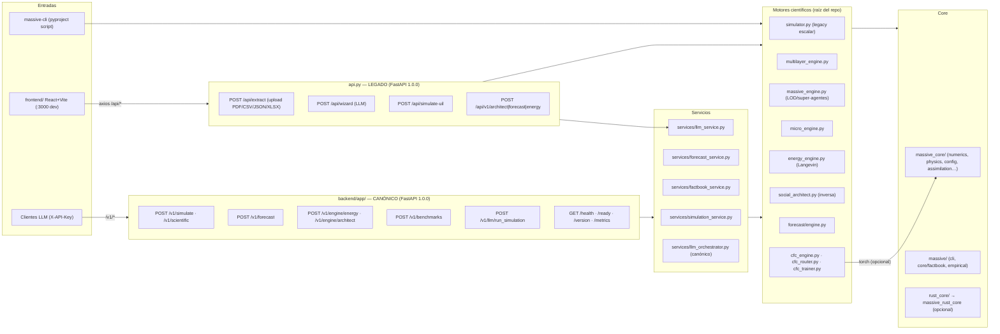

# MASSIVE — Arquitectura: Estado Actual (current-state.md)

> Última verificación: 2026-09-22 · Este documento describe el estado **real y
> verificado** del repositorio, no el deseado. Cada afirmación es comprobable
> ejecutando los comandos citados.

---

## 1. Qué es MASSIVE

Plataforma híbrida de simulación de dinámicas sociales (opinión, polarización,
energía social, forecast, optimización inversa de intervenciones) con:

- Núcleo científico Python (numpy/scipy/networkx) + aceleración Rust **opcional**
  (`massive_rust_core` vía pyo3/maturin).
- Dos superficies HTTP: `backend/app/` (**canónica**, `/v1/*`) y `api.py`
  (**legacy**, `/api/*`, usada por `frontend/`).
- Una UI: `frontend/` (React 18 + Vite + TS), servida como estáticos por el
  backend y construida dentro del Docker multi-stage.
- Integraciones LLM (Groq/OpenAI/OpenRouter/Ollama), CIA World Factbook,
  conectores sociales (Twitter/Reddit), procesamiento de documentos
  (PDF/CSV/JSON/XLSX).

## 2. Mapa de componentes

### 2.1 Puntos de entrada verificados (2026-09-22)

| Entrada | Estado | Evidencia |
|---|---|---|
| `uvicorn api:app` (legacy) | ✅ rutas `/api/extract`, `/api/wizard`, `/api/simulate-uil`, `/api/v1/{architect,forecast,energy}`, `/health`, `/ready`, `/version` | introspección FastAPI |
| `uvicorn backend.app.main:app` (canónico) | ✅ rutas `/v1/*` + infra; `POST /v1/simulate` → 200 con `X-API-Key` | TestClient + smoke ejecutado |
| `python -m massive.cli {version,simulate,forecast,benchmark,serve}` | ✅ verificado 2026-09-22 | ejecutado |
| `python -m benchmarks.runner` | ✅ usado por CI (pvu-validation) | workflows |

### 2.2 Superficies HTTP

| Ruta | Contenido | Contrato |
|---|---|---|
| `api.py` | API legacy monolítica | `/api/*` (la usa `frontend/` vía axios) |
| `backend/app/` | **Canónica** (routers `/v1`, DTOs pydantic `extra=forbid`) | `/v1/*` + alias `/api/v1/*` |

> El kit duplicado `massive-ui-ng/` fue **eliminado** el 2026-09-22
> (respaldo: tag `pre-cleanup-2026-09-22`). El frontend canónico es `frontend/`.

El contrato LLM canónico (`configs/llm_contract/massive_llm_contract.json` v1.1.0)
documenta `POST /v1/llm/run_simulation` con salida `sim_id, motor, config,
summary, narrative, results, assumptions, factbook_params` — implementado por
`backend/app/routers/llm.py` + `services/llm_orchestrator.py` y cubierto por
`tests/test_llm_endpoint.py` y `tests/test_llm_orchestrator_coverage.py`.

## 3. Contenedores y procesos

- `Dockerfile` (multi-stage): wheels → build `frontend/` (React) → runtime slim
  (no-root) + nginx + supervisord; nginx sirve el SPA y proxya `/api/`, `/v1/`,
  `/docs`, `/health`, `/ready`, `/version`, `/metrics`.
  - Puertos: 80 (nginx), 8000 (uvicorn).
- `docker-compose.yml` monta `.env` read-only; healthcheck `curl /docs`.
- La variante Docker legacy (single-service) está archivada en
  `docs/archive/legacy_docker/`.

## 4. Correlaciones del dominio (invariantes)

Las relaciones entre variables del entorno y parámetros del motor están
**bloqueadas por tests de dirección y magnitud** en
`tests/test_correlation_invariants.py`:

| Variable | Efecto | Dirección |
|---|---|---|
| Gini ↑ | Dispersión de ingreso ↑ (media estable) | positiva |
| Gini ↑ | σ del paisaje de energía ↓ (más "afilado") | negativa |
| Gini ↑ | Fuerza de regla_polarizacion ↑ (×(1+gini)) | positiva |
| Desigualdad ↑ | lambda_social (peso de red) ↑ | positiva |
| Déficit fiscal ↑ | Factibilidad de intervención ↓ | negativa |
| Homogeneidad social ↑ | Acoplamiento conformista ↑ | positiva |
| Educación/edad/religión | Volatilidad θ por dimensión (no niveles) | documentada |

## 5. Empaquetado

- `pyproject.toml`: paquetes `massive*`, `massive_core*`, `backend*`,
  `services*`, `benchmarks*`, `micro_massive*`, `forecast*`, `metrics*`,
  `adapters*`, `monitoring*` + módulos raíz como `py-modules` (la lista
  coincide con los archivos existentes; verificado 2026-09-22).
- CLI: `massive-cli = massive.cli.main:main`.
- Rust: construido aparte con maturin (`rust_core/`), nunca requerido.
