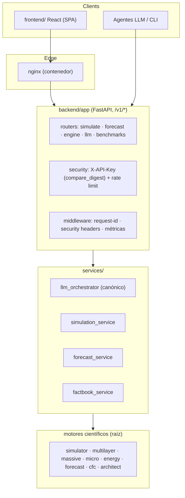

# MASSIVE — Arquitectura Objetivo (target-state.md)

> Complemento de `current-state.md`. Define el estado al que evolucionar **sin alterar el propósito
> científico del simulador**. Los cambios estructurales grandes requieren decisión del owner (marcados ⚠️).

## 1. Principios

1. **Un contrato canónico**: la API pública es `backend/app` (`/v1/*`) + contrato
   `configs/llm_contract/massive_llm_contract.json`. `api.py` es capa de compatibilidad con fecha
   de caducidad declarada.
2. **El núcleo científico es intocable salvo con pruebas**: cualquier cambio en motores
   (simulator, energy, multilayer, massive, micro, forecast, cfc, architect) exige tests de
   caracterización antes y tolerancias definidas después.
3. **Seguro por defecto**: sin claves dev en producción, comparaciones constant-time,
   validación estricta en el borde, límites de tamaño en todos los uploads.
4. **Observable**: logs estructurados con request-id, métricas mínimas, health/readiness reales.

## 2. Vista objetivo

## 3. Decisiones pendientes del owner (⚠️ requieren aprobación)

| # | Decisión | Opciones | Recomendación |
|---|----------|----------|---------------|
| D1 | Destino del kit `massive-ui-ng/` | (a) fusionar de verdad en `backend/`+`frontend/`, (b) mantenerlo como referencia en subdir con CI propio, (c) extraerlo a repo aparte | (b) a corto plazo; (a) solo con plan de migración y contract tests |
| D2 | `api.py` legacy | (a) congelarlo y depreciarlo con header `Deprecation`, (b) migrar sus 3 endpoints `/api/*` usados por el frontend al canónico | (b) en Hito 2+; hasta entonces (a) |
| D3 | Streamlit | (a) eliminar rastro (supervisord/nginx/README), (b) reinstalar streamlit + restaurar app | (a): el árbol no tiene UI Streamlit desde hace tiempo |
| D4 | Purga de historial por token Zapier | (a) solo rotar token, (b) rotar + filtrar historial (destructivo, reescribe SHAs) | (a) rotar es suficiente si el token se invalida; (b) solo si hay exigencia de compliance |
| D5 | Branch protection en main | requerir checks verdes + 1 revisión | habilitar tras Hito 0 |

## 4. Metas técnicas medibles

| Área | Meta | Hito |
|------|------|------|
| CI | 12/12 workflows verdes en main; PR gates obligatorios | 0/3 |
| Tests | suite completa coleccionable; ≥2 contract tests por endpoint `/v1` crítico | 2 |
| Cobertura | medir baseline real en HEAD; fijar umbral = baseline+5% sin bajar | 3 |
| Seguridad | 0 hallazgos críticos/altos abiertos; secretos solo por env | 1 |
| Observabilidad | request-id en 100% de responses; `/metrics` con latencia p95 | 4 |
| Rendimiento | baseline reproducible <10 min; regresiones detectables | 5 |
| Release | tag semver + CHANGELOG + checklist ejecutado | 6 |
